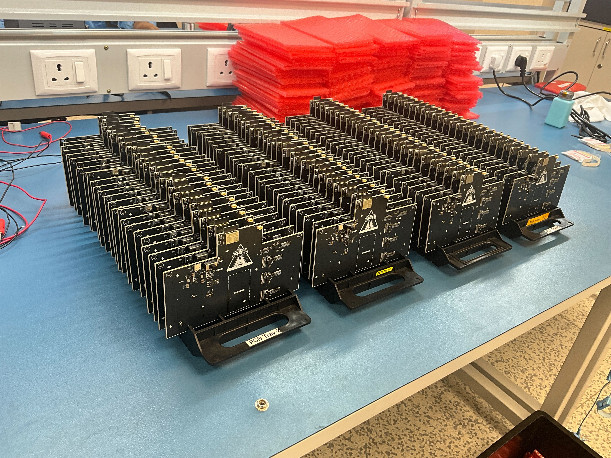

# Firefly Badge Software Repository

## Overview
  
This Firefly Badge features an **11x24 LED Matrix** that provides a visual representation of various countdown timers for tracking Launch and Injection Time. The matrix uses color-coded animations and progress indicators to signal important milestones.  
The software provided in the repository is meant for the Launch Viewing Party being held at Pixxel Space India Office in HBR Layout, Bangalore.  
The badge has been built to act as a souvenir and memento to celebrate the people, their efforts and the countless sleepless nights that went into making Firefly a reality.

**We highly recommend tinkering around with this badge later**. 
It is basically an ESP32-C3 Devkit with an LED Matrix after you leave the party. Feel free to reach out if you need any help getting started. Looking forward to what people end up building with this.
Psst...Psst, you can build a Firefly Themed Table Clock as a starter project.

---
## Installation & Usage
1. **Power ON the Badge**:
   - Connect the provided 9V Battery to the Battery Connector present on the board.
   - Turn ON the board by flipping the Power Switch to the ON Position.
   - Wait a couple of seconds for the ESP32 to fetch relevant information from an API Endpoint hosted locally in Pixxel Office.
   - The **Launch Timer** should start automatically.
2. **Switch to Injection Timer after launch is done**:
   - Press and hold the **Select** button until the blue flashing animation begins.
   - Release the button to transition.
3. **Monitor Progress**:
   - Observe progress bars and flashing indicators to track the timers. Here's to hoping you don't miss watching the Launch :3
4. In order to conserve power and last through the entire launch schedule, the board displays info for 60 seconds and goes to sleep for 20 seconds. Please don't panic if your display goes OFF for a while
---
## LED Matrix Behavior

### 1. **Launch Timer**
- **Initial State**: When the badge is powered ON:
  - Progress towards the **Launch Time** is displayed vertically on the LED Matrix.
  - Each **blue row** represents a step closer to the launch.
- **1 Minute to Launch**:
  - The entire matrix begins flashing **green** to signal the approaching launch time.
- **Post Launch**:
  - The entire matrix glows green.  
---

### 2. **Transition Animation**
- **Activation**:
  - User presses and holds the **Select** button.
- **Animation**:
  - LED Matrix flashes **blue** to confirm the transition. 
- **Completion**:
  - The badge switches between modes once the user releases the button after the blue flashing begins.
---

### 3. **Injection Timer**
- **Initial Display**:
  - The LED Matrix is divided into 3 sections, each **6 rows high**, to display progress for 3 different timers.
  - Progress towards each **Injection Time** is shown by the number of **blue rows lit** in each section.
- **Below 30 Seconds**:
  - The rows corresponding to the timer with less than 30 seconds start flashing **green**.

---

## Technical Details

### LED Matrix
- **Resolution**: 11 columns x 24 rows. 264 RGB LEDs driven by 4  LED Matrix Drivers.
- LED Driver ICs are connected over I2C. VIO_EN and VSYNC are also connected  
### Controller 
- **ESP32-C3-WROOM-02-N4 Module**

### Secret Peripheral
- The PCB has provision for an un-populated component which unlocks a lot more projects that you can do with this badge. Maybe even "Attitude Control" your Firefly :)
### Hardware Design
Refer to the  directory for KiCAD Files of the Firefly Badge PCB. The repo contains final schematics, layout, gerbers and BoM. Reach out if you need any clarifications.  

Basically everything you require to make your own Firefly Badge in case you missed out on getting your hands on one from the Launch Event
  

---

## Troubleshooting
This badge was made in 15 days from when we decided to do it. The software for this was written in 48 hours by an Electronics Engineer with no sleep.  
Excuse the bad coding practices.  
Also, there might be some issues when there are around 200 devices in the wild suddenly with close to zero testing.

---

## Glam Shots

